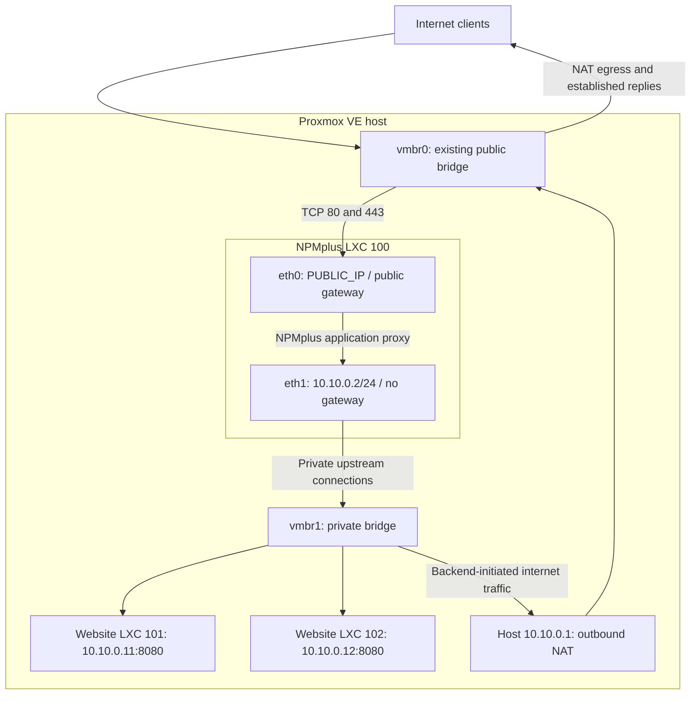

# NPMplus on Proxmox: Private LXCs, ClouDNS TLS, and a Secure Public Proxy

**Meta description:** Build a dual-homed NPMplus LXC on Proxmox with private backends, ClouDNS DNS-01 certificates, firewall rules, and CrowdSec.

## Introduction

This guide is for a homelab owner or Linux administrator who already has Proxmox VE installed and wants to publish websites running in separate containers.

You will build one NPMplus LXC with two network interfaces: a public interface on `vmbr0`, and a private interface on `vmbr1`. Your website LXCs will have private addresses only. NPMplus will reach them directly over the private bridge, terminate HTTPS, and obtain certificates through the ClouDNS DNS API.

Have these ready: a working Proxmox host, its existing `vmbr0` connection, an internal `vmbr1`, an additional usable public IPv4 address, a ClouDNS-hosted authoritative DNS zone with API access, and a tested way to reach the Proxmox console if you make a networking mistake.

My preference is simple: expose the web proxy, keep administration private, and let each backend accept only the traffic it needs. Outbound internet access is compatible with this arrangement. A backend can initiate a connection and receive the response without accepting unsolicited connections from the internet.

## Assumptions and version notes

**Research date: 6 October 2026.** The linked documentation and source were checked for this article on that date. Older publication dates were not treated as proof that the instructions still apply.

- **Proxmox:** the Proxmox VE **9.x** documentation and its default `pve-firewall` implementation. This is a standalone node, without Corosync, Ceph, or migration networks to preserve. A cluster needs additional rules for those existing services. [Proxmox firewall documentation](https://github.com/proxmox/pve-docs/blob/master/pve-firewall.adoc)
- **Guest OS:** a current **Debian 13 standard** LXC template, selected from the actual `pveam` listing. Docker officially supports Debian 13. [Container documentation](https://github.com/proxmox/pve-docs/blob/master/pct.adoc), [Docker on Debian](https://docs.docker.com/engine/install/debian/)
- **NPMplus:** official project **ZoeyVid/NPMplus**, stable release **`2026-07-24-r1`**, source commit **`a30a95471e667a8207c2a349422e4ce9492fcc95`**. This was the latest published stable release found on the research date. The release publishes `docker.io/zoeyvid/npmplus:2026-07-24-r1`; its `latest` tag is described as latest stable. Development-branch instructions can differ. [Official releases](https://github.com/ZoeyVid/NPMplus/releases)
- **Installation:** Docker Engine and the Compose plugin inside an unprivileged LXC. NPMplus's maintainer explicitly discourages Docker inside LXC and prefers Docker on a host or VM. This guide retains the requested LXC architecture; it is a deployment you must validate on your own host. If confinement prevents Docker from working after normal updates, a Debian VM is the safest alternative. Do not make the LXC privileged or disable AppArmor to force it through. [Pinned NPMplus README](https://github.com/ZoeyVid/NPMplus/blob/2026-07-24-r1/README.md)
- **CPU and resources:** NPMplus documents x86-64-v2 and arm64 images. For a normal x86 Proxmox host, confirm x86-64-v2 support. I could not verify an official numeric CPU, RAM, or disk minimum. My starting allocation is **2 vCPU, 4 GiB RAM, a 24 GiB root disk, and a separate 4 GiB log volume** for the proxy and CrowdSec. These are recommendations, not capacity guarantees.
- **IPv4:** this walkthrough deliberately publishes IPv4 only and disables HTTP/3. Do not publish AAAA records until you have separately configured and tested IPv6 routing, listeners, and firewall rules.
- **Verification scope:** the command interfaces, settings, and release-specific behavior were checked against documentation and source. This is not a claim that the complete deployment was run on your Proxmox host or your provider's network.

### Check the public-IP prerequisite

`PUBLIC_IP` belongs to NPMplus alone. It must be different from the Proxmox host's existing management/egress address, called `PVE_HOST_IP` below. The host keeps its own working default route through `vmbr0`; private-backend NAT uses that host address.

Your provider must permit the guest's MAC address and the supplied public prefix/gateway. A routed `/32`, failover-IP product, or required provider virtual MAC needs that provider's documented configuration. I cannot supply a universal gateway or `onlink` route for those products. Verify that part first; do not assign an address that the host already owns. [Proxmox bridged and routed networking](https://github.com/proxmox/pve-docs/blob/master/pve-network.adoc)

### Names used below

The example container IDs are `100` for NPMplus, `101` for website 1, and `102` for website 2. Use unused IDs or substitute your existing backend IDs throughout.

The private addresses are:

- Proxmox gateway on `vmbr1`: `10.10.0.1/24`.
- NPMplus `eth1`: `10.10.0.2/24`, **without a gateway**.
- Website 1: `10.10.0.11/24`, application port `8080`.
- Website 2: `10.10.0.12/24`, application port `8080`.

The walkthrough uses the Proxmox host as a restricted administration jump host. Connections it opens to the private LXCs come from `10.10.0.1`, so the private administration allowance is **`10.10.0.1/32`**, rather than the entire backend subnet. An existing WireGuard VPN is another suitable administration path; allow its actual source addresses and provide a return route before using it.

`ADMIN_CIDR` means your actual management source address or subnet as seen by Proxmox. `DNS_RESOLVER_IP` means a resolver the guests can reach. **`10.10.0.1` is a gateway, not automatically a DNS server.**

All shell commands are run as root unless marked **admin workstation**. Replace uppercase placeholders before running a command. Files named for this tutorial, such as `npmplus-edge.nft`, are files you create below; they are not claimed to ship with the products.

## Architecture



Plain-text equivalent:

```text
Internet -> Proxmox vmbr0 -> NPMplus LXC eth0 [PUBLIC_IP]
NPMplus application -> eth1 [10.10.0.2] -> Proxmox vmbr1
Proxmox vmbr1 -> Website LXC 101 [10.10.0.11:8080]
Proxmox vmbr1 -> Website LXC 102 [10.10.0.12:8080]

Backend outbound internet:
Website LXC -> vmbr1 -> Proxmox gateway [10.10.0.1]
            -> host source NAT -> vmbr0 -> internet

Administration:
Admin source -> restricted Proxmox management SSH
             -> local SSH tunnel -> NPMplus eth1 [10.10.0.2:81, HTTPS]

No website LXC is attached to vmbr0.
No internet port-forward points to a backend.
NPMplus proxies requests; it is not the backends' IP router.
```

The proxy concentrates public web handling in one place. Its admin UI controls routing and certificate credentials, so it deserves a much smaller audience than the websites it publishes. Keeping the backends private also makes their firewall rules straightforward: allow the proxy's private address on the application port, allow the administration path on SSH, and deny other new inbound traffic.

## 1. Prepare networking and create the dual-homed NPMplus LXC

### 1.1 Inspect the existing host

On **Proxmox**:

```bash
pveversion -v
ip -br -4 address
ip -4 route
pve-firewall status
pve-firewall localnet
pvesm status
```

Confirm that the host already has a working default route through `vmbr0`. Record the host's own address separately from the extra address you will give NPMplus.

Set the following variables in this Proxmox shell. Keep this shell open for the host-side steps:

```bash
PVE_NODE="$(hostname -s)"
PVE_HOST_IP='PVE_HOST_IP'
ADMIN_CIDR='ADMIN_CIDR'
PUBLIC_IP='PUBLIC_IP'
PUBLIC_PREFIX='PUBLIC_PREFIX'
PUBLIC_GATEWAY='PUBLIC_GATEWAY'
CT_STORAGE='CT_STORAGE'
DNS_RESOLVER_IP='DNS_RESOLVER_IP'
```

Choose `CT_STORAGE` from `pvesm status`; a default LVM installation commonly has `local-lvm`, but use the storage actually configured on your host.

### 1.2 Allow management before enabling the firewall

**Warning:** a wrong management source can lock you out. Keep a tested console and your current SSH session open. Before any public guest is started, emergency rollback is `pve-firewall stop` from that console; correct the rules and start the firewall again.

These are complete initial files for an otherwise unconfigured **standalone** firewall. If either file already contains policy, back it up and merge the shown sections instead of overwriting it.

```bash
install -d -m 0700 /root/npmplus-before
cp -a /etc/network/interfaces /root/npmplus-before/interfaces
sysctl -n net.ipv4.ip_forward > /root/npmplus-before/ip_forward
mkdir -p /etc/pve/firewall

if [ -f /etc/pve/firewall/cluster.fw ]; then
    cp -a /etc/pve/firewall/cluster.fw /root/npmplus-before/cluster.fw
fi
if [ -f "/etc/pve/nodes/$PVE_NODE/host.fw" ]; then
    cp -a "/etc/pve/nodes/$PVE_NODE/host.fw" /root/npmplus-before/host.fw
fi
```

For an unconfigured firewall, create the datacenter policy **disabled**:

```bash
cat > /etc/pve/firewall/cluster.fw <<EOF
[OPTIONS]
enable: 0
policy_in: DROP
policy_out: ACCEPT

[ALIASES]
local_network $PVE_HOST_IP/32
EOF
```

Then create the node's management allow rules:

```bash
cat > "/etc/pve/nodes/$PVE_NODE/host.fw" <<EOF
[OPTIONS]
enable: 1
log_level_in: nolog
log_level_out: nolog

[RULES]
IN ACCEPT -source $ADMIN_CIDR -p tcp -dport 8006
IN ACCEPT -source $ADMIN_CIDR -p tcp -dport 22
EOF

pve-firewall status
```

Resolve every parser warning before continuing. The input/output policies belong in `cluster.fw`; they are not legacy `host.fw` options. The `local_network` override avoids automatically trusting an entire hosting-provider subnet. Proxmox explicitly recommends a single host address for that public, standalone case. [Firewall configuration and implicit rules](https://github.com/proxmox/pve-docs/blob/master/pve-firewall.adoc), [node options](https://github.com/proxmox/pve-docs/blob/master/generated/pve-firewall-host-opts.adoc)

Now enable the datacenter firewall:

```bash
sed -i 's/^enable: 0$/enable: 1/' /etc/pve/firewall/cluster.fw
pve-firewall start
pve-firewall status
```

**Expected result:** a **new** SSH connection and a new browser connection to `https://PVE_HOST_IP:8006` work from `ADMIN_CIDR`. A surviving old SSH connection alone does not prove your allow rule is correct.

Do not open port 8006 to everyone to solve an access problem. Correct the source address or use your private management/VPN path.

### 1.3 Give `vmbr1` a gateway and outbound NAT

This guide keeps the default `pve-firewall`. The alternative `proxmox-firewall` nftables backend is still labelled a technology preview in the checked documentation. Also, host `FORWARD` rules entered in Proxmox's firewall UI are ignored by the legacy backend. We therefore use the documented iptables NAT mechanism and an explicit, narrowly scoped forwarding drop rule. Native nftables will be used inside the proxy LXC later. [Proxmox firewall backend notes](https://github.com/proxmox/pve-docs/blob/master/pve-firewall.adoc#nftables), [networking and NAT](https://github.com/proxmox/pve-docs/blob/master/pve-network.adoc)

First install the public-to-private forwarding guard. It does not accept traffic ahead of Proxmox's guest rules:

```bash
iptables -w 5 -C FORWARD -i vmbr0 -o vmbr1 \
  -m conntrack ! --ctstate ESTABLISHED,RELATED -j DROP || \
iptables -w 5 -I FORWARD 1 -i vmbr0 -o vmbr1 \
  -m conntrack ! --ctstate ESTABLISHED,RELATED -j DROP

iptables -w 5 -t nat -C POSTROUTING -s 10.10.0.0/24 -o vmbr0 \
  -j MASQUERADE || \
iptables -w 5 -t nat -A POSTROUTING -s 10.10.0.0/24 -o vmbr0 \
  -j MASQUERADE
```

This is the article's adaptation of documented iptables operations: new public-to-private routed traffic is dropped, while replies to backend-initiated connections remain eligible for the existing firewall checks. The public bridge-to-proxy path and private bridge-to-backend path are not routed `vmbr0`-to-`vmbr1` traffic. [iptables commands](https://manpages.debian.org/trixie/iptables/iptables.8.en.html), [conntrack and MASQUERADE matches](https://manpages.debian.org/trixie/iptables/iptables-extensions.8.en.html)

Edit `/etc/network/interfaces`. Preserve the existing `vmbr0` and physical-interface configuration. Ensure that the existing `vmbr1` stanza contains:

```text
auto vmbr1
iface vmbr1 inet static
        address 10.10.0.1/24
        bridge-ports none
        bridge-stp off
        bridge-fd 0
        pre-up iptables -w 5 -C FORWARD -i vmbr0 -o vmbr1 -m conntrack ! --ctstate ESTABLISHED,RELATED -j DROP || iptables -w 5 -I FORWARD 1 -i vmbr0 -o vmbr1 -m conntrack ! --ctstate ESTABLISHED,RELATED -j DROP
        post-up iptables -w 5 -t nat -C POSTROUTING -s 10.10.0.0/24 -o vmbr0 -j MASQUERADE || iptables -w 5 -t nat -A POSTROUTING -s 10.10.0.0/24 -o vmbr0 -j MASQUERADE
        post-down iptables -w 5 -t nat -D POSTROUTING -s 10.10.0.0/24 -o vmbr0 -j MASQUERADE
```

There is **no gateway line on `vmbr1`**. The hooks make only these two rules persistent and avoid adding duplicates. The forwarding denial is installed before the bridge comes up and is deliberately retained during bridge reloads. Do not install an additional rule that accepts every forwarded packet. [ifupdown2 command hooks](https://manpages.debian.org/trixie/ifupdown2/ifupdown-addons-interfaces.5.en.html)

**Warning:** reloading host networking can interrupt access. Use the console if necessary. Rollback is to restore `/root/npmplus-before/interfaces` to `/etc/network/interfaces`, then run `ifreload -a` from the console.

```bash
ifreload -a
ip -4 address show dev vmbr1

cat > /etc/sysctl.d/90-private-lxc-routing.conf <<'EOF'
net.ipv4.ip_forward = 1
EOF
sysctl -p /etc/sysctl.d/90-private-lxc-routing.conf
```

**Expected result:** `vmbr1` owns `10.10.0.1/24`, the host still has its original default route, and IPv4 forwarding is `1`. Nothing forwards an internet service port to a backend.

If you abandon this NAT setup, remove the hooks and restore the previous forwarding setting. Delete only the two rules you added:

```bash
# Rollback only; do not run during a successful installation.
iptables -w 5 -D FORWARD -i vmbr0 -o vmbr1 \
  -m conntrack ! --ctstate ESTABLISHED,RELATED -j DROP
iptables -w 5 -t nat -D POSTROUTING -s 10.10.0.0/24 -o vmbr0 \
  -j MASQUERADE
rm /etc/sysctl.d/90-private-lxc-routing.conf
sysctl -w net.ipv4.ip_forward="$(cat /root/npmplus-before/ip_forward)"
```

Do not use `iptables -F`, `nft flush ruleset`, or a blanket firewall reset on the host.

### 1.4 Download the real Debian template

```bash
pveam update
pveam available --section system | grep 'debian-13-standard'
```

Copy the exact template filename returned by that command:

```bash
TEMPLATE='DEBIAN_13_TEMPLATE_FILENAME_FROM_THE_LIST'
pveam download local "$TEMPLATE"
pveam list local
```

These commands assume the default `local` storage can hold templates. Use your configured template storage if it differs. [Proxmox container templates](https://github.com/proxmox/pve-docs/blob/master/pct.adoc)

### 1.5 Create the stopped proxy container

```bash
pct create 100 "local:vztmpl/$TEMPLATE" \
  --hostname npmplus \
  --unprivileged 1 \
  --features nesting=1,keyctl=1 \
  --cores 2 --memory 4096 --swap 512 \
  --rootfs "$CT_STORAGE:24" \
  --mp0 "$CT_STORAGE:4,mp=/opt/npmplus/nginx/logs,backup=0" \
  --net0 "name=eth0,bridge=vmbr0,ip=$PUBLIC_IP/$PUBLIC_PREFIX,gw=$PUBLIC_GATEWAY,firewall=1,ip6=manual" \
  --net1 "name=eth1,bridge=vmbr1,ip=10.10.0.2/24,firewall=1,ip6=manual" \
  --nameserver "$DNS_RESOLVER_IP" \
  --onboot 1
```

This creates the log volume before Docker starts. It limits how much space NPMplus's file logs can consume independently of the root disk. The log volume is excluded from backups; the database, configuration, and certificates remain on the root disk. The storage must actually enforce the volume's size/quota. [Container mount points and backups](https://github.com/proxmox/pve-docs/blob/master/pct.adoc)

Only the Docker-hosting proxy gets `nesting` and `keyctl`. Keep other special features off. Unprivileged container root is mapped to an unprivileged host identity; it is not Proxmox root. Nesting still weakens isolation relative to a simple container, and all LXCs share the host kernel. [Container security and features](https://github.com/proxmox/pve-docs/blob/master/generated/pct.conf.5-opts.adoc)

### 1.6 Give the proxy its firewall before first boot

Both Proxmox NIC definitions above include `firewall=1`. In the Proxmox firewall file, the names are **`net0` and `net1`**, even though Linux inside the LXC calls them `eth0` and `eth1`.

```bash
cat > /etc/pve/firewall/100.fw <<EOF
[OPTIONS]
enable: 1
ipfilter: 1
macfilter: 1
policy_in: DROP
policy_out: ACCEPT
log_level_in: nolog
log_level_out: nolog

[RULES]
IN ACCEPT -i net0 -dest $PUBLIC_IP -p tcp -dport 80
IN ACCEPT -i net0 -dest $PUBLIC_IP -p tcp -dport 443
IN ACCEPT -i net1 -source 10.10.0.1/32 -dest 10.10.0.2 -p tcp -dport 81
IN ACCEPT -i net1 -source 10.10.0.1/32 -dest 10.10.0.2 -p tcp -dport 22
EOF

pve-firewall status
pct start 100
pct exec 100 -- ip -br -4 address
pct exec 100 -- ip -4 route
```

Proxmox requires the global firewall, the guest firewall, and each NIC's firewall flag. IP/MAC filtering helps stop a guest from impersonating another guest's allowed address. [Guest firewall behavior](https://github.com/proxmox/pve-docs/blob/master/pve-firewall.adoc), [guest options](https://github.com/proxmox/pve-docs/blob/master/generated/pve-firewall-vm-opts.adoc)

**Expected result:** `eth0` owns `PUBLIC_IP`; `eth1` owns `10.10.0.2`; there is one default route, through the public gateway on `eth0`, and a connected route to `10.10.0.0/24` through `eth1`.

Do not add `10.10.0.1` as a second default gateway on the proxy.

## 2. Install NPMplus and complete the first login

### 2.1 Update the Debian LXC

On **Proxmox**:

```bash
pct enter 100
```

You are now **inside the proxy LXC**:

```bash
apt update
apt full-upgrade
apt install ca-certificates curl nano openssl bind9-dnsutils unattended-upgrades
dpkg-reconfigure -plow unattended-upgrades
```

Enable automatic updates when prompted. Review `/etc/apt/apt.conf.d/50unattended-upgrades` and keep the Debian security origin enabled. Keep automatic reboots disabled; schedule disruptive maintenance yourself.

```bash
cat > /etc/apt/apt.conf.d/52-no-unattended-reboot <<'EOF'
Unattended-Upgrade::Automatic-Reboot "false";
EOF
unattended-upgrade --dry-run --debug
```

This updates eligible Debian packages, not the NPMplus Docker image. [Debian unattended upgrades](https://manpages.debian.org/trixie/unattended-upgrades/unattended-upgrade.8.en.html)

On an x86 host, inspect the CPU capabilities visible to the LXC:

```bash
/lib/ld-linux-x86-64.so.2 --help
```

Look for x86-64-v2 support. Do not use this x86-specific command on arm64.

### 2.2 Install Docker from its Debian repository

The following is for a fresh Debian 13 LXC without conflicting Docker packages:

```bash
install -m 0755 -d /etc/apt/keyrings
curl -fsSL https://download.docker.com/linux/debian/gpg \
  -o /etc/apt/keyrings/docker.asc
chmod a+r /etc/apt/keyrings/docker.asc

cat > /etc/apt/sources.list.d/docker.sources <<EOF
Types: deb
URIs: https://download.docker.com/linux/debian
Suites: trixie
Components: stable
Architectures: $(dpkg --print-architecture)
Signed-By: /etc/apt/keyrings/docker.asc
EOF

apt update
apt install docker-ce docker-ce-cli containerd.io docker-buildx-plugin docker-compose-plugin
systemctl enable --now docker
docker run --rm hello-world
docker compose version
```

These package names and repository fields follow [Docker's official Debian installation instructions](https://docs.docker.com/engine/install/debian/). Do not mix this installation with Debian's `docker.io` package.

**Expected result:** the test container exits successfully and `docker compose version` reports the installed plugin.

If Docker fails with AppArmor, mount, or permission errors, stop here and inspect `journalctl -u docker` in the LXC and the Proxmox host logs. Apply normal Proxmox/LXC updates first. If the nested deployment still cannot run confined, use a VM; do not add `privileged`, `unconfined`, arbitrary device access, or extra capabilities as a workaround.

### 2.3 Create the NPMplus Compose project

The official install method is Docker Compose. This compact configuration retains the official runtime restrictions and sets this article's listener, logging, and certificate-profile choices. [Pinned Compose reference](https://github.com/ZoeyVid/NPMplus/blob/2026-07-24-r1/compose.yaml)

```bash
install -d -m 0700 /opt/npmplus-stack
chmod 0700 /opt/npmplus
cd /opt/npmplus-stack
nano compose.yaml
```

Save this, replacing `PUBLIC_IP` and `ACME_EMAIL`:

```yaml
name: npmplus
services:
  npmplus:
    image: docker.io/zoeyvid/npmplus:2026-07-24-r1
    container_name: npmplus
    restart: unless-stopped
    network_mode: host
    cap_drop:
      - ALL
    cap_add:
      - NET_BIND_SERVICE
      - SETGID
    security_opt:
      - no-new-privileges:true
    volumes:
      - /opt/npmplus:/data
    environment:
      TZ: Etc/UTC
      ACME_EMAIL: ACME_EMAIL
      ACME_PROFILE: classic
      IPV4_BINDING: PUBLIC_IP
      NPM_IPV4_BINDING: 10.10.0.2
      DISABLE_IPV6: "true"
      DISABLE_H3_QUIC: "true"
      LOGROTATE: "true"
      LOGROTATIONS: "3"
      INITIAL_DEFAULT_PAGE: "444"
    logging:
      driver: local
      options:
        max-size: "10m"
        max-file: "3"
```

`network_mode: host` means the **LXC's network namespace**, not the Proxmox node. There is no Docker `ports:` section. NPMplus can bind its website listeners to the public address and its administration listener to the private address directly. Docker does not create per-service port-publishing rules for host networking. [Docker networking and firewall behavior](https://docs.docker.com/engine/network/packet-filtering-firewalls/)

The release defaults to Let's Encrypt's `shortlived` profile. I explicitly choose `classic` here to give a new installation more time to recover from renewal failures. As checked on 6 October, Let's Encrypt documents 90 days for `classic` and 160 hours for `shortlived`. This is an operational choice, not a requirement for DNS-01. Leave the TLS defaults and Must-Staple setting alone. [Let's Encrypt profiles](https://letsencrypt.org/docs/profiles/)

HTTP/3 is deliberately disabled, so the public firewall needs TCP 80 and TCP 443 only. If you later choose HTTP/3, remove that setting and explicitly allow UDP 443. Do not enable QUIC BPF or add capabilities for this baseline.

```bash
chmod 0600 compose.yaml
docker compose config --quiet
docker compose pull
docker compose up -d --wait --wait-timeout 300
docker compose ps
docker exec npmplus nginx -t
ss -lntup
```

**Expected result:** public web listeners use `PUBLIC_IP:80` and `PUBLIC_IP:443`; the admin listener uses **`10.10.0.2:81`**. It must not listen on `PUBLIC_IP:81`, `0.0.0.0:81`, or `[::]:81`.

The Compose wait avoids testing while first-start initialization is still running. If it times out, inspect `docker compose logs --tail=100 npmplus` before proceeding. [Compose health waiting](https://docs.docker.com/reference/cli/docker/compose/up/)

Verify the separate log filesystem reaches Docker:

```bash
df -h / /opt/npmplus/nginx/logs
docker exec npmplus df -h /data /data/nginx/logs
```

The log path should show its approximately 4 GiB filesystem, separately from the approximately 24 GiB root disk. Investigate a shared filesystem before relying on this storage limit.

### 2.4 Open the private HTTPS admin UI

On your **admin workstation**, use your existing source-restricted Proxmox SSH connection:

```bash
ssh -N -o ExitOnForwardFailure=yes \
  -L 127.0.0.1:8443:10.10.0.2:81 root@PVE_HOST_IP
```

Open `https://localhost:8443` in your browser. NPMplus uses **HTTPS on port 81**. The initial certificate is not a trusted certificate for `localhost`; use this known local tunnel for bootstrap, not a public HTTP connection.

Leave `INITIAL_ADMIN_EMAIL` and `INITIAL_ADMIN_PASSWORD` unset. In a normal installation, this release presents a setup screen for creating your admin account. That behavior was checked in [the setup code](https://github.com/ZoeyVid/NPMplus/blob/2026-07-24-r1/backend/setup.js) and [environment initialization](https://github.com/ZoeyVid/NPMplus/blob/2026-07-24-r1/rootfs/usr/local/bin/envs.sh); the default-password comments in the release's Compose file do not describe this normal setup path.

Create a unique, strong password in your password manager. Then enable native 2FA:

1. Open the account dropdown and select **Two-Factor Auth**.
2. Choose **Enable Two-Factor Authentication**.
3. Scan the QR code with your authenticator.
4. Choose **Verify and Enable** after entering the current code.
5. Store the backup codes separately and confirm you saved them.

TOTP and backup codes are verified features of this pinned release. [Two-factor dialog](https://github.com/ZoeyVid/NPMplus/blob/2026-07-24-r1/frontend/src/modals/TwoFactorModal.tsx)

**Expected result:** you can log in through the private tunnel, and a fresh login requires your second factor. Port 81 remains unreachable from the internet.

## 3. Configure the private website LXCs

### 3.1 Keep each backend on `vmbr1` only

Use an existing application LXC if you already have one. Set its only NIC to `vmbr1`, its private address, gateway `10.10.0.1`, and the NIC firewall flag. Make changes from the Proxmox console during a maintenance window: changing the NIC can interrupt existing connections. Save `pct config CT_ID` before changing it so you can restore its full original NIC definition, including any MAC or VLAN settings.

For two new Debian example LXCs, return to the **Proxmox host shell** and use the variables from step 1:

```bash
pct create 101 "local:vztmpl/$TEMPLATE" \
  --hostname website1 --unprivileged 1 \
  --cores 1 --memory 1024 --swap 256 --rootfs "$CT_STORAGE:8" \
  --net0 "name=eth0,bridge=vmbr1,ip=10.10.0.11/24,gw=10.10.0.1,firewall=1,ip6=manual" \
  --nameserver "$DNS_RESOLVER_IP" --onboot 1

pct create 102 "local:vztmpl/$TEMPLATE" \
  --hostname website2 --unprivileged 1 \
  --cores 1 --memory 1024 --swap 256 --rootfs "$CT_STORAGE:8" \
  --net0 "name=eth0,bridge=vmbr1,ip=10.10.0.12/24,gw=10.10.0.1,firewall=1,ip6=manual" \
  --nameserver "$DNS_RESOLVER_IP" --onboot 1
```

These small allocations are only for the example; size real applications for their workload. An application that uses Docker will need its own reviewed nesting requirements. Do not enable them on every guest automatically.

### 3.2 Install the backend firewall before starting it

For these two new guests, whose example app port is `8080`:

```bash
for CT_ID in 101 102; do
    cat > "/etc/pve/firewall/$CT_ID.fw" <<'EOF'
[OPTIONS]
enable: 1
ipfilter: 1
macfilter: 1
policy_in: DROP
policy_out: ACCEPT
log_level_in: nolog
log_level_out: nolog

[RULES]
IN ACCEPT -i net0 -source 10.10.0.2/32 -p tcp -dport 8080
IN ACCEPT -i net0 -source 10.10.0.1/32 -p tcp -dport 22
EOF
done

pve-firewall status
pct start 101
pct start 102
```

For an existing application, merge these rules and replace `8080` with its actual port. **Do not replace the proxy source with `0.0.0.0/0`.** There is no inbound internet allowance for these guests.

`policy_out: ACCEPT` allows the guests to initiate outbound connections. Stateful filtering permits their replies. Source NAT supplies internet reachability; it is not a port-forward into the guest. [Proxmox NAT behavior](https://github.com/proxmox/pve-docs/blob/master/pve-network.adoc)

### 3.3 Make sure the application listens on a reachable private socket

In each backend LXC:

```bash
ip -br -4 address
ip -4 route
ss -lntp
apt update
```

Configure the application to listen on its own private address and port, for example `10.10.0.11:8080`. If the application must listen on `127.0.0.1`, run a local reverse proxy **inside that same backend LXC** listening on `10.10.0.11:8080`. NPMplus in another LXC cannot reach the backend's loopback socket.

If you need a temporary working endpoint before installing a real app, the following is for a **new, otherwise unused Debian backend only**. Run it inside LXC 101; repeat inside 102 with `APP_IP=10.10.0.12`:

```bash
APP_IP='10.10.0.11'
apt install nginx
cat > /etc/nginx/sites-available/private-demo <<EOF
server {
    listen $APP_IP:8080;
    server_name _;
    location / {
        default_type text/plain;
        return 200 "Private backend $APP_IP is working.\n";
    }
}
EOF
ln -s /etc/nginx/sites-available/private-demo /etc/nginx/sites-enabled/private-demo
nginx -t && systemctl reload nginx
```

The distribution's default site may still listen on private port 80, which these firewall rules do not permit. On a new demo guest you can disable that default site's symlink; do not delete or replace an existing application's configuration. Replace the temporary demo with your real app when ready. The example uses standard [Nginx listen and location directives](https://nginx.org/en/docs/http/ngx_http_core_module.html) and [return](https://nginx.org/en/docs/http/ngx_http_rewrite_module.html#return).

Now test from **inside the NPMplus LXC**:

```bash
curl --connect-timeout 5 http://10.10.0.11:8080/
curl --connect-timeout 5 http://10.10.0.12:8080/
```

**Expected result:** both return the intended application response. Each backend can run `apt update`, but a new connection from website 2 to website 1's app port is denied. If outbound access fails only after enabling a guest firewall, use the conntrack-zone troubleshooting section below.

Apply the Debian security-update setup from step 2.1 to both backends as well.

## 4. Create proxy hosts for the private backends

In ClouDNS, create ordinary A records for `app1.example.com` and `app2.example.com`, both pointing to `PUBLIC_IP`. Substitute your own domain. Remove an incorrect AAAA record rather than leaving clients to try an unconfigured IPv6 path.

The examples below publish ordinary public websites. For a dashboard that must have a limited audience, create the access list described in section 9.2 first and attach it **before initially saving the proxy host**.

In NPMplus, open **Proxy Hosts** and add a proxy host. For website 1, enter:

- **Domain Names:** `app1.example.com`.
- **Scheme:** `http`.
- **Forward Hostname / IP / Path:** `10.10.0.11`.
- **Forward Port:** `8080`.

Save it. Repeat for `app2.example.com`, forwarding to `10.10.0.12:8080`. These fields are verified in the [pinned proxy-host dialog](https://github.com/ZoeyVid/NPMplus/blob/2026-07-24-r1/frontend/src/modals/ProxyHostModal.tsx).

Use the scheme your backend actually speaks. Public HTTPS does not mean the private app must use HTTPS. If you use HTTPS upstream, configure a verifiable backend certificate and matching name; do not make disabling certificate verification your standard fix for a 502.

From an **admin workstation**, verify routing independently of DNS propagation:

```bash
curl --resolve app1.example.com:80:PUBLIC_IP http://app1.example.com/
curl --resolve app2.example.com:80:PUBLIC_IP http://app2.example.com/
```

**Expected result:** each hostname returns its own backend's response. Finish the HTTPS step before submitting passwords or private data through these sites. An application intended to be private should also receive an access list before normal use.

Keep databases, dashboards, and debug ports out of NPMplus's public host list. The fact that the proxy can reach a private service is not a reason to publish it.

## 5. Obtain Let's Encrypt certificates with ClouDNS DNS-01

### 5.1 Use the native ClouDNS integration

This release contains a **ClouDNS** provider using `certbot-dns-cloudns`. NPMplus installs the plugin inside its Docker container. You do not need a second Certbot installation in Debian, a custom DNS hook, or a separate renewal timer. [Provider registry](https://github.com/ZoeyVid/NPMplus/blob/2026-07-24-r1/backend/certbot/dns-plugins.json), [plugin installation code](https://github.com/ZoeyVid/NPMplus/blob/2026-07-24-r1/backend/lib/certbot.js)

DNS-01 is the right choice when you need wildcard certificates, want certificates before publishing a service, or keep a service's web ports private. Validation happens through a TXT record in authoritative DNS. It does **not** require inbound 80, 443, or 53 on your LXC; this architecture opens 80/443 for website visitors. The proxy does need outbound DNS and HTTPS. [Let's Encrypt challenge types](https://letsencrypt.org/docs/challenge-types/)

ClouDNS confirms HTTP API access on its Premium DNS and DDoS Protected DNS plans. Verify that your account has API entitlement; do not assume a free zone includes it. A DNS provider's DDoS-protected DNS product does not protect this server's website uplink. [ClouDNS Certbot guide](https://www.cloudns.net/wiki/article/448/)

### 5.2 Create a dedicated, restricted API sub-user

ClouDNS uses an API identity and an **API password**, rather than a bearer-token field. From your trusted workstation, open **API & Resellers → API Sub-Users → Add new sub-user**. [ClouDNS authentication instructions](https://www.cloudns.net/wiki/article/42/)

Use these choices:

- A unique sub-user for this proxy.
- **Read and write**, because validation must create and remove TXT records.
- An **IP address** restriction matching the proxy's actual public egress address.
- Quotas appropriate for the zone, with room for temporary TXT records and concurrent renewals.
- No unnecessary mail-forward or failover capacity.

Save the generated sub-user ID and API password in your password manager. Keep the parent account's main API credentials off the proxy.

**Zone quotas are not zone permissions.** Delegate only the existing zone you intend this sub-user to manage. I verified ClouDNS's delegation API, but not an exact current signed-in button label for that action, so here is the documented method instead. [Delegate zone API](https://www.cloudns.net/wiki/article/126/)

The helper below needs a regular **API User** in the ClouDNS account that owns the zone. It does not use your website login password or the sub-user's password. If needed, use **API & Resellers → API Users → Add new user**, create an API password, restrict access to your workstation's public egress IP, and note the generated `auth-id`. Keep these parent credentials on the workstation. [ClouDNS API-user setup](https://www.cloudns.net/wiki/article/42/)

On your **trusted admin workstation**, save this as `cloudns-delegate-zone.py` and run it once for the required zone. Python 3 is required. Credentials are prompted, kept out of the command line, and sent in an HTTPS POST body:

```python
import getpass
import json
import urllib.parse
import urllib.request

fields = {
    "auth-id": input("Parent API user ID: ").strip(),
    "auth-password": getpass.getpass("Parent API password: "),
    "id": input("NPMplus API sub-user ID: ").strip(),
    "zone": input("Existing zone, for example example.com: ").strip(),
}

request = urllib.request.Request(
    "https://api.cloudns.net/sub-users/delegate-zone.json",
    data=urllib.parse.urlencode(fields).encode("utf-8"),
    method="POST",
)
with urllib.request.urlopen(request, timeout=30) as response:
    result = json.load(response)

print(json.dumps(result, indent=2))
```

```bash
python3 cloudns-delegate-zone.py
```

**Expected result:** the API response confirms delegation. Read the response body: ClouDNS can return an API failure in a successful HTTP response, and an already-delegated zone can also produce a descriptive failure response. The parent API user's own IP restriction must allow this workstation.

The verified restrictions are zone delegation, access level, source IP, and quotas. **I could not verify a TXT-only or `_acme-challenge`-only permission.** Do not mistake a record-count quota for that kind of authorization. For stronger separation, the ClouDNS plugin supports challenge CNAME delegation to a separate validation zone; that is an optional extension, not required for this walkthrough. [Official ClouDNS plugin](https://github.com/cloudns/certbot-dns-cloudns)

### 5.3 Request a per-host or wildcard certificate

For two sites, my preference is separate certificates for `app1.example.com` and `app2.example.com`: the names and keys are easy to inventory.

Choose `*.example.com` when you deliberately want one certificate for many first-level subdomains. That wildcard does not cover `example.com` itself or `api.app1.example.com`. Add the apex as a separate certificate name if you need it. A wildcard certificate does not require a wildcard A record; publish only the DNS names you intend to serve. [TLS wildcard matching, RFC 9525](https://www.rfc-editor.org/rfc/rfc9525.html#section-6.3)

In the verified NPMplus release, use **Certificates → Add Certificate → Certbot via DNS**. Then:

1. Enter the desired **Domain Names**.
2. Choose **ClouDNS** as the **DNS Provider**.
3. Replace **Credentials File Content** with the sub-user form below.
4. Set **Propagation Seconds** to `120` as an initial operational choice.
5. Leave **Reuse Key** off unless you have a specific requirement.
6. Save and wait for issuance.

```ini
dns_cloudns_sub_auth_id = CLOUDNS_SUB_AUTH_ID
dns_cloudns_auth_password = CLOUDNS_AUTH_PASSWORD
```

`CLOUDNS_SUB_AUTH_ID` is the generated sub-user ID. If you intentionally use a regular API user, its identity key is `dns_cloudns_auth_id = CLOUDNS_AUTH_ID` instead. **Choose one identity key only**; do not leave the regular-user line active alongside the sub-user line.

The plugin's documented default propagation wait is 60 seconds. The recommended 120 seconds is a starting margin, not a guarantee from ClouDNS. Increase it only when DNS evidence shows that authoritative publication is lagging. [NPMplus DNS form](https://github.com/ZoeyVid/NPMplus/blob/2026-07-24-r1/frontend/src/components/Form/DNSProviderFields.tsx), [ClouDNS plugin credentials and propagation](https://github.com/cloudns/certbot-dns-cloudns)

### 5.4 Assign the certificate and verify HTTPS

Edit the appropriate proxy host, open its **TLS** tab, choose the certificate, and enable **Force HTTPS**. Keep HSTS and its subdomain/preload option off until every affected hostname is consistently available over HTTPS. Do not enable Must-Staple for Let's Encrypt. [Pinned proxy-host UI and TLS options](https://github.com/ZoeyVid/NPMplus/blob/2026-07-24-r1/frontend/src/modals/ProxyHostModal.tsx), [NPMplus certificate environment settings](https://github.com/ZoeyVid/NPMplus/blob/2026-07-24-r1/compose.yaml)

From your **admin workstation**:

```bash
curl --resolve app1.example.com:443:PUBLIC_IP https://app1.example.com/
curl --resolve app2.example.com:443:PUBLIC_IP https://app2.example.com/
```

Do not add `-k` to this public-certificate check.

To inspect the actual certificate served with the correct SNI name:

```bash
openssl s_client -connect PUBLIC_IP:443 -servername app1.example.com </dev/null 2>/dev/null \
  | openssl x509 -noout -subject -issuer -dates -ext subjectAltName
```

**Expected result:** both HTTPS requests succeed with normal certificate verification, and each hostname serves the intended application. HTTP requests redirect to HTTPS after Force HTTPS is enabled.

### 5.5 Protect the credentials where NPMplus actually stores them

In this release, credentials are retained **in plaintext in the SQLite database**. NPMplus also writes a mode-`0600` temporary file inside Docker at `/tmp/certbot-credentials/credentials-CERT_ID` and recreates that file from the database on startup. The persistent database is `/opt/npmplus/npmplus/database.sqlite` in this LXC; ACME data lives below `/opt/npmplus/tls/certbot`. [Certificate implementation](https://github.com/ZoeyVid/NPMplus/blob/2026-07-24-r1/backend/internal/certificate.js), [startup reconstruction](https://github.com/ZoeyVid/NPMplus/blob/2026-07-24-r1/backend/setup.js), [database configuration](https://github.com/ZoeyVid/NPMplus/blob/2026-07-24-r1/backend/lib/config.js)

After first login has created the database, set its permissions explicitly and check without printing secrets, **inside the proxy LXC**:

```bash
chmod 0700 /opt/npmplus/npmplus
chmod 0600 /opt/npmplus/npmplus/database.sqlite

docker exec npmplus sh -c \
  'stat -c "%a %U:%G %n" /tmp/certbot-credentials/credentials-*'

stat -c '%a %U:%G %n' \
  /opt/npmplus/npmplus \
  /opt/npmplus/npmplus/database.sqlite
```

**Expected result:** credential/database files are `600`; the database directory is `700`. The default runtime identity is root inside the unprivileged LXC, not host root. NPMplus restricts existing data files at startup; the explicit commands also cover a database created after that first permission pass. [Permission enforcement](https://github.com/ZoeyVid/NPMplus/blob/2026-07-24-r1/rootfs/usr/local/bin/start.sh)

Enter the API password only through the private HTTPS admin connection. Do not put it in Compose, command history, screenshots, or a shared support log. Protect the **whole** NPMplus backup: protecting a temporary INI file does not protect the database copy of the secret.

For planned credential rotation, this release does **not** expose an edit action for managed DNS certificates. Create a new restricted ClouDNS sub-user, then request a replacement certificate for the same names through **Certbot via DNS** with the new credentials. Test its renewal, assign it to every affected proxy host, and verify what each site serves. Until cleanup, rollback is to select the old certificate again. [Release-specific certificate actions](https://github.com/ZoeyVid/NPMplus/blob/2026-07-24-r1/frontend/src/pages/Certificates/Table.tsx), [separate Certbot certificate names](https://eff-certbot.readthedocs.io/en/stable/using.html#re-creating-and-updating-existing-certificates)

**Warning:** deleting an NPMplus certificate attempts revocation and cannot be undone. Delete the old certificate only after it has no remaining users and the replacement works; then retire the old ClouDNS sub-user. Do not edit SQLite or the temporary credential file. [Certificate deletion implementation](https://github.com/ZoeyVid/NPMplus/blob/2026-07-24-r1/backend/internal/certificate.js)

### 5.6 Verify automatic renewal safely

NPMplus checks renewal at startup and every **three hours** by default. Certbot decides whether renewal is due, and NPMplus reloads Nginx afterward. Do not add a competing Debian Certbot timer. [Renewal timer and reload](https://github.com/ZoeyVid/NPMplus/blob/2026-07-24-r1/backend/internal/certificate.js), [default interval](https://github.com/ZoeyVid/NPMplus/blob/2026-07-24-r1/rootfs/usr/local/bin/envs.sh)

List the managed certificate names:

```bash
docker exec npmplus certbot --config /etc/certbot.ini certificates
docker exec npmplus certbot --version
docker exec npmplus pip show certbot-dns-cloudns
```

The plugin is installed or upgraded at runtime, so record its actual version; pinning NPMplus alone does not freeze that dependency.

Use the certificate name returned above, commonly `npm-CERT_ID`, for one staging test:

```bash
docker exec npmplus certbot --config /etc/certbot.ini renew \
  --cert-name npm-CERT_ID \
  --dry-run \
  --server https://acme-staging-v02.api.letsencrypt.org/directory
```

**Expected result:** successful simulated renewal, with the production certificate left in place. The explicit staging endpoint makes the intended test server unambiguous. If another Certbot process holds a lock, let it finish and retry later. [Certbot dry-run behavior](https://eff-certbot.readthedocs.io/en/stable/using.html#renewing-certificates)

Do not use the release's **Renew Certificate** button as a harmless test: its code attempts revocation before forced renewal. Do not add `--force-renewal`, `--break-my-certs`, or deployment hooks to the staging test. [Release-specific renewal action](https://github.com/ZoeyVid/NPMplus/blob/2026-07-24-r1/backend/internal/certificate.js)

Monitor the expiry of the certificate actually served on port 443. For the `classic` choice here, an alert when fewer than 14 days remain is a reasonable starting policy. A deliberately short-lived profile needs much earlier, more frequent failure detection relative to its lifetime.

## 6. Harden SSH without losing access

The preferred default is **no public SSH into any LXC**. The firewall already permits guest SSH only from the Proxmox jump host. The Proxmox console remains available if you choose to run no SSH server in a guest.

### 6.1 Create and test a named guest administrator

For a guest where you want SSH, use its Proxmox console or `pct enter CT_ID`:

```bash
apt install openssh-server sudo nano
adduser ops
usermod -aG sudo ops
install -d -m 0700 -o ops -g ops /home/ops/.ssh
touch /home/ops/.ssh/authorized_keys
chown ops:ops /home/ops/.ssh/authorized_keys
chmod 0600 /home/ops/.ssh/authorized_keys
nano /home/ops/.ssh/authorized_keys
```

Append your workstation's **public** key. Keep its private key on the workstation. The local password set by `adduser` can be used for `sudo`; disabling SSH password authentication does not remove local sudo authentication.

From the **admin workstation**, test the key through the existing Proxmox jump host:

```bash
ssh -o PasswordAuthentication=no -o KbdInteractiveAuthentication=no \
  -J root@PVE_HOST_IP ops@10.10.0.2
```

Test `sudo -v` in that session. Repeat for backend addresses where SSH is required. If you use a nondefault key, add the appropriate `-i /path/to/private_key` to the final guest connection.

### 6.2 Apply a key-only guest policy

**Warning:** apply this only after a new key-based login and sudo work. Rollback from the Proxmox console is to remove this tutorial's drop-in, run `sshd -t`, and reload `ssh`.

Inside the guest:

```bash
cat > /etc/ssh/sshd_config.d/00-private-admin.conf <<'EOF'
PubkeyAuthentication yes
AuthenticationMethods publickey
PasswordAuthentication no
KbdInteractiveAuthentication no
PermitRootLogin no
AllowUsers ops
X11Forwarding no
AllowAgentForwarding no
EOF

sshd -t
sshd -T | grep -E '^(authenticationmethods|passwordauthentication|kbdinteractiveauthentication|permitrootlogin|allowusers) '
systemctl reload ssh
```

Use a fresh terminal to test again before closing the old session. Debian processes these settings with first-value precedence; another earlier setting or a `Match` block may change the effective result. If you use `Match`, inspect the relevant connection with `sshd -T -C`. [Debian OpenSSH configuration](https://manpages.debian.org/trixie/openssh-server/sshd_config.5.en.html)

Changing port 22 is optional noise reduction, not an authentication control. If you do change it, update both the service and the narrow private firewall rule before testing. There is no public SSH exception in this guide.

**Expected result:** `ops` can log in by key through the approved administration path; password logins and direct guest root SSH logins fail.

### 6.3 Harden the Proxmox host's SSH separately

First put your administration public key into the host's existing `/root/.ssh/authorized_keys` without replacing other required keys. Confirm a new key-only login from `ADMIN_CIDR`.

For this standalone host, retain root key access so the chosen jump-host path continues to work:

**Warning:** keep console access and a tested key session open. If this policy excludes you, remove only `/etc/ssh/sshd_config.d/00-management-keys.conf` from the console, run `sshd -t`, and reload `ssh`. Add any other required administrator to `AllowUsers` before applying it.

```bash
cat > /etc/ssh/sshd_config.d/00-management-keys.conf <<'EOF'
PubkeyAuthentication yes
AuthenticationMethods publickey
PasswordAuthentication no
KbdInteractiveAuthentication no
PermitRootLogin prohibit-password
AllowUsers root
X11Forwarding no
AllowAgentForwarding no
EOF

sshd -t
sshd -T | grep -E '^(authenticationmethods|passwordauthentication|kbdinteractiveauthentication|permitrootlogin|allowusers) '
systemctl reload ssh
```

If you already use other named SSH administrators, include their actual usernames in `AllowUsers`. Do not apply an account restriction that excludes the administrator you just tested. On a cluster, preserve Proxmox's required node-to-node root-key operations.

**Rollback:** remove only `/etc/ssh/sshd_config.d/00-management-keys.conf` from the console, validate with `sshd -t`, and reload `ssh`. Keep the network source restriction in place.

## 7. Complete the Proxmox and LXC firewall baseline

### 7.1 Check the complete policy

The firewall was enabled early because the public container should never start with an open management interface. Here is the intended final policy. These are rules for **new inbound connections**; established replies are handled by the stateful firewall.

| System and interface | Source | Destination / port | Action |
|---|---|---|---|
| Proxmox host input | `ADMIN_CIDR` | Host TCP 22 and 8006 | Allow |
| Proxmox host input | Other sources | Other new connections | Drop, subject to documented Proxmox implicit rules |
| Proxmox routed forwarding | New traffic from `vmbr0` | `vmbr1` | Drop |
| NPMplus `net0` / `eth0` | Internet | `PUBLIC_IP`, TCP 80 and 443 | Allow |
| NPMplus `net0` / `eth0` | Any | Other new inbound application traffic, including 22 and 81 | Drop |
| NPMplus `net1` / `eth1` | `10.10.0.1/32` | `10.10.0.2`, TCP 22 and 81 | Allow |
| Website `net0` / `eth0` | `10.10.0.2/32` | Its application port, TCP 8080 | Allow |
| Website `net0` / `eth0` | `10.10.0.1/32` | TCP 22, if SSH is used | Allow |
| Every LXC | Other sources | Other new inbound connections | Drop |
| Every LXC | Locally initiated traffic | Internet and permitted private destinations | Allow outbound; replies allowed |

The table lists application-service access. Proxmox retains documented protocol-control exceptions, including DHCP/NDP where enabled and essential ICMP for path-MTU and error handling. Do not add a blanket ICMP drop. [Proxmox default firewall rules](https://github.com/proxmox/pve-docs/blob/master/pve-firewall.adoc)

The host's INPUT policy protects the host itself. It does not replace guest filtering for packets bridged to an LXC or between two LXCs. Keep the firewall enabled on **both** proxy NICs and on every backend NIC. Interface-specific rules prevent a public allowance from also becoming a private-interface allowance. [Proxmox firewall rules and guest interfaces](https://github.com/proxmox/pve-docs/blob/master/pve-firewall.adoc)

On **Proxmox**, inspect the resulting configuration:

```bash
pve-firewall status
pct config 100
pct config 101
pct config 102
iptables -w 5 -nvL FORWARD --line-numbers
iptables -w 5 -t nat -nvL POSTROUTING
```

Test the actual paths: proxy to both applications succeeds; website 1 to website 2's app port fails; a backend's `apt update` succeeds. Keep IP and MAC filtering on all private guests so another container cannot simply claim the proxy's address.

**Expected result:** ordinary app-to-app connections are denied unless you add a specific business requirement. Add narrowly scoped exceptions for real dependencies such as a database; never change an inbound source to `0.0.0.0/0` just to restore outbound access.

### 7.2 Add a modest nftables SYN limit inside the proxy

Keep Proxmox responsible for the allow/drop policy. Use this additional nftables table **inside LXC 100** for a per-source limit on new public web SYN packets and to prevent accidental routing between the proxy's NICs.

The example uses a per-IPv4-source token bucket that refills at 50 SYN packets per second and holds a burst of 100, shared across ports 80 and 443. The ten-second timeout expires an idle source entry; it is not a ten-second ban. This is a policy suggestion for a small installation, not a safe universal threshold. A busy office behind one public IP may need more; distributed attackers can use many IPs. nftables meters provide the per-key behavior commonly implemented with iptables `hashlimit`. [nftables meters](https://wiki.nftables.org/wiki-nftables/index.php/Meters)

**Warning:** keep the Proxmox console available while testing. Rollback is `systemctl disable --now npmplus-edge.service`; its stop action removes only this tutorial's table. The Proxmox firewall stays in place.

Inside the **proxy LXC**:

```bash
apt install nftables
install -d -m 0755 /etc/nftables.d

cat > /etc/nftables.d/npmplus-edge.nft <<'EOF'
destroy table inet npmplus_edge
table inet npmplus_edge {
    set web_syn4 {
        type ipv4_addr
        flags dynamic,timeout
        timeout 10s
        size 65535
    }

    chain input {
        type filter hook input priority -10; policy accept;
        iifname "eth0" tcp dport { 80, 443 } ct state new tcp flags & (syn | ack) == syn update @web_syn4 { ip saddr limit rate over 50/second burst 100 packets } counter drop
    }

    chain forward {
        type filter hook forward priority -10; policy accept;
        iifname "eth0" oifname "eth1" counter drop
        iifname "eth1" oifname "eth0" counter drop
    }
}
EOF

nft -c -f /etc/nftables.d/npmplus-edge.nft
```

The check must succeed before loading the table. `destroy table` replaces only this tutorial's table in the same transaction, avoiding duplicate rules on repeated loads. If the LXC's confinement rejects the operation, retain Proxmox filtering and the later NPMplus controls; do not add privileged features or disable AppArmor to make this optional layer work.

Do **not** enable a generic `nftables.service` configuration containing `flush ruleset`. Docker and CrowdSec can maintain their own tables in this same LXC. Use a service that owns only the table above:

```bash
cat > /etc/systemd/system/npmplus-edge.service <<'EOF'
[Unit]
Description=NPMplus local SYN limits and routing guard
Before=docker.service

[Service]
Type=oneshot
RemainAfterExit=yes
ExecStart=/usr/sbin/nft -f /etc/nftables.d/npmplus-edge.nft
ExecStop=-/usr/sbin/nft delete table inet npmplus_edge

[Install]
WantedBy=multi-user.target
EOF

systemctl daemon-reload
systemctl enable --now npmplus-edge.service
nft list table inet npmplus_edge
```

Use `systemctl restart npmplus-edge.service` after a validated edit. Its forward-chain drops do not affect NPMplus's normal work: NPMplus accepts a connection locally and originates a separate connection to a backend.

**Expected result:** the two websites still work, private administration still works, and the `npmplus_edge` table is present. It contains no blanket ruleset flush and makes no changes to the Proxmox host's firewall. [nftables command reference](https://manpages.debian.org/trixie/nftables/nft.8.en.html), [systemd service commands](https://manpages.debian.org/trixie/systemd/systemd.service.5.en.html)

### 7.3 Keep kernel tuning proportionate

Check SYN cookies on both the **Proxmox host** and **proxy LXC**:

```bash
sysctl net.ipv4.tcp_syncookies
```

The Linux default is `1`. If your effective setting is `0`, review why it was changed; enabling `1` is a reasonable baseline where the namespace permits it:

```bash
cat > /etc/sysctl.d/91-syn-cookies.conf <<'EOF'
net.ipv4.tcp_syncookies = 1
EOF
sysctl -p /etc/sysctl.d/91-syn-cookies.conf
```

SYN cookies help when the SYN backlog overflows. They do not increase uplink capacity or make expensive HTTP requests cheap. The kernel documentation explicitly describes them as a fallback, not a substitute for sizing a busy server. If the container cannot change this setting, do not grant extra privileges; inspect the host/kernel configuration instead. [Linux TCP sysctls](https://docs.kernel.org/networking/ip-sysctl.html)

Connection limits restrict concurrent work; rate limits restrict how quickly work arrives. A per-source firewall meter can curb one noisy client before TLS processing. The Nginx limits in section 9 act later, after HTTP is available, and are better suited to protecting applications. None is a complete DDoS defense.

### 7.4 Update the host and keep the package sources intentional

On **Proxmox**, review its configured repositories before upgrading. Use the enterprise repository with a subscription. For a homelab without one, the official `pve-no-subscription` repository is available, but Proxmox warns that its packages receive less validation and are not recommended for production.

Use the current Proxmox 9 repository documentation or the node's repository management page. Do not paste Debian 12/`bookworm` repository lines into this Debian 13/`trixie` host. Review any Ceph enterprise source too; do not blindly enable or replace Ceph repositories when you are not using Ceph. [Official Proxmox package repositories](https://pve.proxmox.com/pve-docs/pve-admin-guide.html#sysadmin_package_repositories)

Then, in a maintenance window:

```bash
apt update
apt full-upgrade
pveversion -v
```

Resolve repository/signature errors; do not bypass them. Reboot for host kernel updates when required and verify the firewall, networking, and guests afterward.

Apply the Debian security-update setup from section 2.1 to both website LXCs too. Keep their package set small. Do not install a mail server, database, FTP server, or Docker daemon on the proxy unless it is actually part of your design. Docker images need their own update process; Debian automatic security updates do not replace the pinned NPMplus image.

Leave AppArmor enabled. Keep backend nesting off unless the backend has a documented need. Do not copy `lxc.apparmor.profile: unconfined`, device passthrough, broad capabilities, or privileged-container settings from an unrelated troubleshooting post. [Proxmox container security](https://github.com/proxmox/pve-docs/blob/master/pct.adoc)

### 7.5 Back up the data, then prove you can restore it

Use a backup destination outside this host's failure domain. In this layout, the proxy root disk contains the Compose project under `/opt/npmplus-stack`, NPMplus database and certificate secrets under `/opt/npmplus`, native CrowdSec configuration under `/etc/crowdsec`, and its state under `/var/lib/crowdsec`. Preserve those together.

**Warning:** the following backup uses stop mode and interrupts these containers. Schedule it. The guests that were running are restarted by the backup workflow; investigate a failed job from the Proxmox console before manually restarting services.

On **Proxmox**, with a configured backup-capable storage:

```bash
vzdump 100 101 102 --storage BACKUP_STORAGE --mode stop --compress zstd
```

Stop mode gives a straightforward consistency boundary for the SQLite database. Choose scheduled backups through your normal Proxmox backup workflow afterward. The explicitly excluded `mp0` log volume is not a source of configuration or certificate data. [Proxmox backup modes and mount-point inclusion](https://github.com/proxmox/pve-docs/blob/master/vzdump.adoc)

Also back up the host's `/etc/network/interfaces`, tutorial sysctl files, `/etc/pve/firewall/`, and node `host.fw` through your host-configuration backup process. A container backup does not back up these host files.

After a restore, **recreate or verify the excluded log volume before starting Docker**. Check both `df` commands from section 2.3; a plain directory on the root disk is not an equivalent replacement. Test a restored proxy on isolated networking so it cannot duplicate the live public IP.

Before updating NPMplus, read the target release notes, take a consistent backup, change the image pin in `compose.yaml`, then run:

```bash
cd /opt/npmplus-stack
docker compose pull
docker compose up -d --wait --wait-timeout 300
docker compose ps
docker exec npmplus nginx -t
```

Allow a brief service interruption. If an update requires rollback after a database migration, restore the matching earlier data and image together. Simply changing the image tag back may leave an incompatible database.

**Expected result:** you have a successful backup job, a separate copy of host configuration, and a documented restore test. Treat backups as sensitive: they contain the ClouDNS password and private TLS keys.

## 8. Add CrowdSec, and use fail2ban only where it still helps

### 8.1 Install the native CrowdSec engine in the proxy LXC

CrowdSec's engine reads events and makes decisions. A **bouncer**, also called a remediation component, enforces them. We will use NPMplus's built-in HTTP/AppSec integration and a native nftables firewall bouncer. The latter can block IPs before a connection reaches Nginx, while the HTTP integration inspects requests. All enforcement stays on your host. [CrowdSec installation](https://docs.crowdsec.net/u/getting_started/installation/linux/), [firewall and HTTP bouncer roles](https://docs.crowdsec.net/u/bouncers/firewall/)

Inside the **proxy LXC**, add the official package repository using CrowdSec's documented manual method:

```bash
apt install debian-archive-keyring gnupg
install -d -m 0755 /etc/apt/keyrings

curl -fsSL https://packagecloud.io/crowdsec/crowdsec/gpgkey \
  -o /tmp/crowdsec-repository-key.asc
gpg --dearmor --yes \
  --output /etc/apt/keyrings/crowdsec_crowdsec-archive-keyring.gpg \
  /tmp/crowdsec-repository-key.asc
chmod 0644 /etc/apt/keyrings/crowdsec_crowdsec-archive-keyring.gpg

cat > /etc/apt/sources.list.d/crowdsec_crowdsec.list <<'EOF'
deb [signed-by=/etc/apt/keyrings/crowdsec_crowdsec-archive-keyring.gpg] https://packagecloud.io/crowdsec/crowdsec/any any main
EOF

apt update
apt-cache policy crowdsec
apt install crowdsec
cscli version
```

Confirm the candidate comes from the intended official repository and record the installed version. The acquisition configuration below follows the checked CrowdSec **1.8** documentation. Do not add a speculative high-priority APT pin if the candidate is already correct.

Install the collection NPMplus specifies, plus SSH detection if this LXC runs SSH:

```bash
cscli hub update
cscli collections install ZoeyVid/npmplus
cscli collections install crowdsecurity/sshd
cscli collections list
```

Use the actual NPMplus log path from this layout. The AppSec listener is loopback-only because the NPMplus Docker container shares the LXC network namespace:

```bash
install -d -m 0755 /etc/crowdsec/acquis.d

cat > /etc/crowdsec/acquis.d/npmplus.yaml <<'EOF'
filenames:
  - /opt/npmplus/nginx/logs/*.log
labels:
  type: npmplus
---
source: appsec
name: appsec
listen_addr: 127.0.0.1:7422
appsec_configs:
  - crowdsecurity/appsec-default
labels:
  type: appsec
EOF
```

The path and log label come from NPMplus's release README; the plural `appsec_configs` form comes from current CrowdSec documentation. Keep the collection's AppSec dependencies installed. [Pinned NPMplus CrowdSec instructions](https://github.com/ZoeyVid/NPMplus/blob/2026-07-24-r1/README.md#crowdsec), [CrowdSec AppSec acquisition](https://docs.crowdsec.net/docs/appsec/configuration_creation_testing/)

For SSH, first inspect `/etc/crowdsec/acquis.yaml` and existing files in `/etc/crowdsec/acquis.d/`. If package setup already acquires the same SSH journal, keep that single source. Otherwise add:

```bash
cat > /etc/crowdsec/acquis.d/ssh-journal.yaml <<'EOF'
source: journalctl
journalctl_filter:
  - "_SYSTEMD_UNIT=ssh.service"
labels:
  type: syslog
EOF
```

Do not ingest the same SSH events twice through both a journal source and an auth-log source. [CrowdSec journald acquisition](https://docs.crowdsec.net/docs/log_processor/data_sources/journald/)

Inspect `/etc/crowdsec/config.yaml`. Preserve its other settings and keep `api.server.listen_uri` at `127.0.0.1:8080`; keep metrics on `127.0.0.1:6060` if enabled. These services do not need a public or private-bridge listener. [CrowdSec configuration defaults](https://github.com/crowdsecurity/crowdsec/blob/master/config/config.yaml)

Validate and start:

```bash
crowdsec -t -c /etc/crowdsec/config.yaml
systemctl enable crowdsec
systemctl restart crowdsec
systemctl --no-pager --full status crowdsec
ss -lntp
```

**Expected result:** CrowdSec is running; LAPI is on loopback port 8080 and AppSec is on loopback port 7422. Fix configuration errors before connecting NPMplus to it.

### 8.2 Connect the existing NPMplus bouncer

Generate a dedicated bouncer key:

```bash
cscli bouncers add npmplus
```

The command prints a secret. Copy it directly into your private editor/password manager; do not paste it into a shell command or this article. [Bouncer-key command](https://docs.crowdsec.net/docs/cscli/cscli_bouncers_add/)

Back up the current integration file:

```bash
cp -a /opt/npmplus/crowdsec/crowdsec.conf \
  /opt/npmplus/crowdsec/crowdsec.conf.before-enable
nano /opt/npmplus/crowdsec/crowdsec.conf
```

Change only the following existing settings, preserving the rest:

```ini
ENABLED=true
API_URL=http://127.0.0.1:8080
API_KEY=BOUNCER_API_KEY
APPSEC_URL=http://127.0.0.1:7422
APPSEC_FAILURE_ACTION=deny
```

Replace `BOUNCER_API_KEY` in the editor. This is a CrowdSec key, unrelated to the ClouDNS credential.

**Warning:** enabling AppSec changes request handling, and its `deny` failure policy can make websites unavailable if AppSec fails. Rollback is to restore `crowdsec.conf.before-enable` over `crowdsec.conf` and recreate NPMplus with the command below. Test during a maintenance window.

```bash
chmod 0600 /opt/npmplus/crowdsec/crowdsec.conf
cd /opt/npmplus-stack
docker compose up -d --force-recreate --wait --wait-timeout 300
docker exec npmplus nginx -t
cscli bouncers list
cscli metrics
```

A plain Nginx reload is insufficient when enabling or disabling this integration: NPMplus's startup script controls the include file. Recreating the container makes the configuration change explicit and allows Compose to wait for health. [Bouncer configuration](https://github.com/ZoeyVid/NPMplus/blob/2026-07-24-r1/rootfs/etc/crowdsec.conf.example), [startup integration](https://github.com/ZoeyVid/NPMplus/blob/2026-07-24-r1/rootfs/usr/local/bin/start.sh)

Visit both websites, then inspect:

```bash
cscli metrics show appsec
cscli alerts list
cscli decisions list
```

**Expected result:** the bouncer authenticates, NPMplus log acquisition shows activity, and AppSec metrics show requests after you browse. A running engine with no acquired events is not a verified installation.

Test your real application's logins, uploads, API calls, and streaming behavior. NPMplus documents request-buffering implications when CrowdSec is enabled. Do not assume a WAF change is transparent to every application, or use a locally returned probe-path 404 as proof of WAF inspection.

### 8.3 Add the nftables firewall bouncer

Inside the **proxy LXC**:

```bash
apt install crowdsec-firewall-bouncer-nftables
systemctl enable --now crowdsec-firewall-bouncer
systemctl --no-pager --full status crowdsec-firewall-bouncer
cscli bouncers list
nft list tables
```

The package normally registers its own local bouncer credential. Verify an active service and a recent **Last API pull** in `cscli bouncers list`; registration alone does not prove it is running. [Verified package registration helper](https://github.com/crowdsecurity/cs-firewall-bouncer/blob/a09363eebbd5ba90e8aea205728bf26194d11bf2/scripts/_bouncer.sh), [CrowdSec health checks](https://docs.crowdsec.net/u/getting_started/health_check/)

If registration did not complete, generate a **separate** key with `cscli bouncers add npmplus-firewall`. In an editor, set these fields in `/etc/crowdsec/bouncers/crowdsec-firewall-bouncer.yaml`, preserving the other packaged settings and managed mode:

```yaml
mode: nftables
api_url: http://127.0.0.1:8080/
api_key: BOUNCER_API_KEY
```

Then protect the file and restart:

```bash
chmod 0600 /etc/crowdsec/bouncers/crowdsec-firewall-bouncer.yaml
systemctl restart crowdsec-firewall-bouncer
systemctl --no-pager --full status crowdsec-firewall-bouncer
cscli bouncers list
```

The bouncer manages its own tables. Do not merge them into `npmplus_edge`, flush the ruleset, or apply Proxmox-host rules inside this LXC. NPMplus uses Docker **host networking**, so its incoming connections traverse the LXC's INPUT path. The bridged-Docker `DOCKER-USER` advice does not apply to this NPMplus service. [CrowdSec firewall bouncer](https://docs.crowdsec.net/u/bouncers/firewall/), [Docker host-network firewall behavior](https://docs.docker.com/engine/network/packet-filtering-firewalls/)

If nftables operations are denied by LXC confinement, keep the NPMplus HTTP bouncer and Proxmox rules, document the missing earlier blocking layer, and investigate through supported Proxmox/Docker paths. Do not loosen container confinement merely for the bouncer.

For one controlled enforcement test, use a **separate external test client you own**. Its source must differ from your administration path.

**Warning:** this deliberately blocks the chosen test address for two minutes. Rollback from the proxy console is `cscli decisions delete --ip TEST_CLIENT_IP`. Do not use your jump-host address.

```bash
cscli decisions add --ip TEST_CLIENT_IP --duration 2m --reason tutorial-check
```

After the firewall bouncer has polled, try the public website from that client. With its packaged DROP action, the connection should time out before reaching Nginx. An HTTP block page proves only the NPMplus bouncer's enforcement; check the firewall bouncer's recent API pull and **dropped-packet metrics** to verify the earlier network layer too. Check the decision and metrics, then remove the test:

```bash
cscli decisions list
cscli metrics show bouncers
cscli decisions delete --ip TEST_CLIENT_IP
```

**Expected result:** the test client is blocked while the decision is active and works again after it is removed and caches/polling catch up. This proves enforcement, not automatic detection of an attack. [Manual decision commands](https://docs.crowdsec.net/docs/cscli/cscli_decisions_add/), [firewall bouncer metrics](https://docs.crowdsec.net/u/bouncers/firewall/#metrics)

Keep CrowdSec's SSH collection if you use guest SSH, but understand the source: a connection through the Proxmox jump host appears as `10.10.0.1`. CrowdSec normally ignores private-address events through its parser whitelist, so failed logins from that source normally do not create a scenario ban. Existing or manual decisions can still apply. Your source firewall and key-only SSH policy are the primary protection for this path; do not remove a private whitelist merely to produce a demonstration ban that could block every administrator behind the jump host. [CrowdSec private-address whitelisting](https://docs.crowdsec.net/u/getting_started/post_installation/whitelists/)

### 8.4 Where fail2ban still fits

Do not put fail2ban and CrowdSec in charge of the same proxy SSH log stream by habit. That usually means duplicate detection, separate ban lists, and harder troubleshooting.

A reasonable optional use for fail2ban is **SSH on the Proxmox host**, where this guide does not install a CrowdSec engine. It is most useful if your approved administration source is a shared VPN/subnet. With one tightly restricted source and key-only SSH, its additional value is limited. It is not a reason to expose SSH to everyone.

If you want that extra host layer, use Debian's packaged SSH filter and an iptables action compatible with the default Proxmox firewall:

**Warning:** a ban can block an administrator behind a shared source IP. Keep the console open. Rollback is `fail2ban-client set sshd unbanip ADMIN_IP`, or stop only fail2ban while repairing its jail.

On **Proxmox**:

```bash
apt install fail2ban

cat > /etc/fail2ban/jail.d/sshd.local <<'EOF'
[sshd]
enabled = true
backend = systemd
port = 22
banaction = iptables[type=multiport]
maxretry = 5
findtime = 10m
bantime = 1h
EOF

fail2ban-client -t
systemctl enable --now fail2ban
systemctl restart fail2ban
fail2ban-client status sshd
```

These thresholds are a starting policy. The systemd backend reads the journal; do not add a `logpath` to this jail. After a Proxmox firewall restart, confirm the jail's enforcement still exists. Keep fail2ban's own log rotation active. [Debian fail2ban package and included actions](https://packages.debian.org/trixie/fail2ban), [jail configuration](https://manpages.debian.org/trixie/fail2ban/jail.conf.5.en.html)

**Expected result:** the optional host jail is active and reading SSH events. The host's port 22 source restriction and key-only authentication remain the controls you rely on first.

### 8.5 Bound logs and watch disk space

Our Compose file sets Docker's `local` log driver with a 10 MiB file limit and three files. NPMplus's file logs have their own rotation: `LOGROTATE=true` and `LOGROTATIONS=3`. These are different log streams. [Docker local driver](https://docs.docker.com/engine/logging/drivers/local/), [NPMplus log settings](https://github.com/ZoeyVid/NPMplus/blob/2026-07-24-r1/compose.yaml)

NPMplus's checked logrotate configuration is time-based and uses `copytruncate`; its scheduler is not a hard per-file size cap. Under a flood, logs can grow before rotation. That is why the proxy has a separate, size-limited log volume. Do not add a competing logrotate job for the same files. [Pinned rotation policy](https://github.com/ZoeyVid/NPMplus/blob/2026-07-24-r1/rootfs/etc/logrotate), [rotation scheduler](https://github.com/ZoeyVid/NPMplus/blob/2026-07-24-r1/rootfs/usr/local/bin/launch.sh)

Inside the **proxy LXC**, bound the journal as well:

```bash
install -d -m 0755 /etc/systemd/journald.conf.d

cat > /etc/systemd/journald.conf.d/10-log-budget.conf <<'EOF'
[Journal]
SystemMaxUse=128M
RuntimeMaxUse=32M
SystemKeepFree=256M
MaxRetentionSec=7d
EOF

systemctl restart systemd-journald
journalctl --disk-usage
df -h / /opt/npmplus/nginx/logs
```

These are recommended budgets for this small guest, not hard bounds on every byte written by the system. Keep CrowdSec's `common.log_max_size` and `common.log_max_files` finite; its checked defaults are 20 MB and 10 files. Keep the firewall bouncer's `deny_log` false and its own size/backup limits finite. [Debian journal limits](https://manpages.debian.org/trixie/systemd/journald.conf.5.en.html), [CrowdSec engine defaults](https://github.com/crowdsecurity/crowdsec/blob/master/config/config.yaml), [bouncer logging options](https://docs.crowdsec.net/u/bouncers/firewall/)

Alert before the log volume, root disk, or Proxmox storage pool fills. A full log volume can stop useful logging and weaken CrowdSec detection; a thin-provisioned host pool can still fill even with per-volume limits. Avoid logging every dropped firewall packet. Enable detailed logs briefly for a specific fault, then turn them back down.

CrowdSec's community service can exchange attack metadata and reputation information. Review its documented sharing behavior for your site; visitors' application traffic is still handled locally in this design. [CrowdSec shared signal metadata](https://docs.crowdsec.net/docs/central_api/intro/#signal-meta-data)

## 9. Lock down administration and add per-site controls

### 9.1 Verify that administration is actually private

NPMplus administration is already bound to `10.10.0.2:81`, restricted to the jump host by the Proxmox guest firewall, and protected with a strong password and the release's verified TOTP 2FA.

Keep using the SSH tunnel from section 2.4, or your deliberately configured private VPN path. Do not create a public proxy host pointing back to port 81: that would publish the administration service through port 443 and undo the intended boundary.

From an **external client outside your management allowance**, test:

```bash
curl -k -I --connect-timeout 5 https://PUBLIC_IP:81/
curl -k -I --connect-timeout 5 https://PVE_HOST_IP:8006/
```

Here `-k` is used only to distinguish a reachable TLS listener from a blocked connection. It is not a certificate-validation test.

**Expected result:** both connections are refused or time out. Any HTTP response or successful TLS connection means the service is reachable and needs investigation. From your approved administration path, both management services should still work.

Keep the host UI's access limited even when its password is strong. Administrative interfaces deserve source restrictions because a software flaw would bypass the usefulness of a good password.

### 9.2 Use access lists for sites with a limited audience

For a private dashboard that you intentionally publish through NPMplus:

1. Open **Access Lists → Add Access List**.
2. In **Details**, give it a meaningful **Name**.
3. Leave **Authorizations** empty for this IP-only example.
4. In **Rules**, add **Allow** for the actual viewer source CIDR and retain the final **Deny all**.
5. Edit the proxy host. Under **Details → Global Access Lists**, choose **Custom**, click **Add**, and select the named list.
6. Save. If the host has custom locations, leave each location's access-list choice at **Global** so it inherits the host's policy.

These are the fixed release's labels. “Global Access Lists” refers to that proxy host's default, not every host in NPMplus. Choosing **Publicly Accessible** on a custom location bypasses the inherited list. [Access-list editor](https://github.com/ZoeyVid/NPMplus/blob/2026-07-24-r1/frontend/src/modals/AccessListModal.tsx), [attachment and inheritance controls](https://github.com/ZoeyVid/NPMplus/blob/2026-07-24-r1/frontend/src/components/Form/AccessFields.tsx)

The source here is the viewer's address **as seen by NPMplus**. It is not `10.10.0.2`, which is what a backend sees when NPMplus opens an upstream connection. Ordinary public websites can remain **Publicly Accessible** and use their own application authentication.

If you also add basic authentication, understand **Satisfy Any**: it allows either successful IP authorization or successful password authorization. Leave it off when both must pass. I would not rely on the **Pass Auth to Upstream** label in this release: its template behavior warrants inspecting and testing the generated Authorization header handling. The IP-only example avoids that ambiguity. [Access-list rendering](https://github.com/ZoeyVid/NPMplus/blob/2026-07-24-r1/backend/templates/proxy_host.conf)

**Expected result:** the intended client can reach the restricted site, and a client outside the list receives a denial. Test custom paths too. An access list on a proxy host does not secure the separate NPMplus admin listener.

### 9.3 Add request, concurrency, and body-size limits

NPMplus supports custom Nginx includes and per-host advanced configuration. Its stable UI does not provide a useful stock **Block Common Exploits** switch to enable here, so use the verified configuration surfaces instead. [Pinned proxy-host UI](https://github.com/ZoeyVid/NPMplus/blob/2026-07-24-r1/frontend/src/modals/ProxyHostModal.tsx)

Inside the **proxy LXC**, edit the supported HTTP-context include:

```bash
cp -a /opt/npmplus/custom_nginx/http_top.conf \
  /opt/npmplus/custom_nginx/http_top.conf.before-limits
nano /opt/npmplus/custom_nginx/http_top.conf
```

Preserve existing content. Add these definitions **once**:

```nginx
limit_req_zone "$server_name:$binary_remote_addr" zone=site_requests:10m rate=10r/s;
limit_conn_zone "$server_name:$binary_remote_addr" zone=site_connections:10m;
```

**Warning:** invalid Nginx configuration can prevent a later restart. Rollback is to restore `http_top.conf.before-limits`, validate, and reload. Test before reloading:

```bash
docker exec npmplus nginx -t && docker exec npmplus nginx -s reload
```

Then edit each proxy host's **Advanced → Custom Nginx Configuration** and add:

```nginx
limit_req zone=site_requests burst=40 nodelay;
limit_req_status 429;
limit_req_dry_run on;

limit_conn site_connections 40;
limit_conn_status 429;
limit_conn_dry_run on;

client_max_body_size 20m;

location ~* (^|/)\.git(?:/|$) {
    return 404;
}
location ~* (^|/)\.env(?:[./]|$) {
    return 404;
}
```

The shared-memory zone definitions belong in `http_top.conf`, not the server-level Advanced box. The limits belong on the individual host, where you can tune them for its actual workload. [NPMplus custom includes](https://github.com/ZoeyVid/NPMplus/blob/2026-07-24-r1/README.md), [Nginx request limits](https://nginx.org/en/docs/http/ngx_http_limit_req_module.html), [connection limits](https://nginx.org/en/docs/http/ngx_http_limit_conn_module.html)

These example values are recommendations:

- Requests: 10 per second per virtual host and client IP, with a burst allowance of 40.
- Concurrency: 40 active requests/connections as counted by Nginx's module. Concurrent HTTP/2 requests count individually.
- Request body: at most 20 MiB, including upload/multipart overhead. Increase it for an application that intentionally accepts larger uploads.

The two `dry_run on` directives let you observe excess without enforcing rate/concurrency rejection. Body-size and probe-path restrictions are already active. Exercise normal browsing, logins, uploads, and API calls, then change **both** dry-run lines to `off` and save to enforce the limits.

Clients behind one NAT address share the allowance. The `$server_name` key separates virtual hosts, so this is not an aggregate server-capacity limit. A custom location that defines its own `limit_req` or `limit_conn` can replace the inherited settings for that directive family. [Nginx limit inheritance and dry run](https://nginx.org/en/docs/http/ngx_http_limit_req_module.html), [request body limits](https://nginx.org/en/docs/http/ngx_http_core_module.html#client_max_body_size)

The probe rules return 404 for exposed Git metadata and common environment-file paths. Keep them only if those paths are not legitimate application endpoints. They do not repair an application that publishes secrets somewhere else, and they are not a substitute for updates.

**Expected result:** normal application traffic works, oversized bodies receive 413, and excess traffic receives 429 after enforcement is enabled. Known probe paths return 404 unless another active protection blocks them earlier. Repeat `docker exec npmplus nginx -t` after the final changes.

## Opinionated security checklist

| Done | Check |
|---|---|
| ☐ | NPMplus alone owns `PUBLIC_IP`; the Proxmox host keeps its separate management/egress address. |
| ☐ | Proxy `eth0` is on `vmbr0`; `eth1` is `10.10.0.2/24` on `vmbr1`, with no second gateway. |
| ☐ | Every website LXC is private-only on `vmbr1`; none has a public NIC or internet port-forward. |
| ☐ | Backend internet access works through host source NAT; unsolicited public-to-private forwarding is denied. |
| ☐ | Datacenter, node, guest, and both proxy-NIC firewalls are enabled; a new management connection has been tested. |
| ☐ | Public web access is limited to TCP 80/443; HTTP/3 and public IPv6 remain off for this baseline. |
| ☐ | NPMplus HTTPS port 81 and Proxmox port 8006 fail an external test outside the administration allowance. |
| ☐ | Guest SSH uses named users and keys; root/password SSH is disabled in guests; host root is key-only. |
| ☐ | NPMplus has a unique strong password, TOTP enabled, and safely stored recovery codes. |
| ☐ | Backend app ports accept only `10.10.0.2`; guest IP/MAC filtering prevents easy address impersonation. |
| ☐ | ClouDNS uses a dedicated restricted sub-user; only the necessary zone is delegated. |
| ☐ | Credential/database permissions are restricted, sensitive backups are protected, and no secrets entered shell history. |
| ☐ | Both sites serve a trusted certificate; a staging renewal test succeeded; expiry monitoring is configured. |
| ☐ | CrowdSec acquisition, AppSec request metrics, and at least one bouncer enforcement test have been checked. |
| ☐ | nftables SYN thresholds and NPMplus per-site limits have been tested against legitimate traffic; dry run is off where enforcement is intended. |
| ☐ | fail2ban is used only for a justified, separate SSH role, with a documented unban path. |
| ☐ | Log budgets and storage alerts cover the proxy log volume, root disks, and the host's storage pool. |
| ☐ | Debian security updates, scheduled Proxmox maintenance, and NPMplus image updates have an owner. |
| ☐ | A backup and isolated restore test succeeded, including the excluded log-volume check. |
| ☐ | Unprivileged mode and AppArmor remain enabled; backend nesting and unrelated privileged features remain off. |

## Troubleshooting

### NPMplus returns 502

Start with the upstream, from **inside the proxy LXC**:

```bash
ip -4 route get 10.10.0.11
curl -v --connect-timeout 5 http://10.10.0.11:8080/
```

The route should use `eth1` with source `10.10.0.2`. In the backend, run `ss -lntp` and check the app's logs.

A refusal usually means the service is stopped or listening on a different socket. A timeout usually points toward filtering or routing. An app listening only on its own `127.0.0.1` is unreachable from the proxy. Also check the chosen upstream scheme and port.

On **Proxmox**, confirm the backend rule allows `10.10.0.2` on the actual app port and that both proxy NICs have their intended addresses. In the proxy, inspect bounded diagnostics:

```bash
cd /opt/npmplus-stack
docker compose logs --tail=100 npmplus
docker exec npmplus nginx -t
```

Do not solve a 502 by adding a public backend NIC or opening its port to everyone.

### ClouDNS DNS-01 fails

Check these in order:

1. The certificate names are beneath the zone you delegated.
2. The credential uses exactly one correct identity key: regular API user or sub-user.
3. The password is an API password for that identity.
4. The sub-user has read/write access, sufficient quotas, and the correct source-IP restriction.
5. ClouDNS is authoritative for the domain, and all authoritative nameservers publish the challenge.
6. The propagation wait is long enough for observed publication.
7. Existing CAA records permit the chosen certificate authority.

From the **proxy LXC**, use the installed `dig`:

```bash
dig +short NS example.com
dig CAA example.com
dig +short TXT _acme-challenge.app1.example.com @AUTHORITATIVE_NS
```

Use a nameserver returned by the NS query. For an apex/wildcard request, the challenge owner is `_acme-challenge.example.com`; follow any deliberately configured challenge CNAME. Inspect TXT records while validation is active, because successful cleanup removes temporary records.

Read NPMplus's certificate error and a small log excerpt, redacting credentials before sharing it. Use the documented staging dry run after fixing the cause. Opening port 80 will not fix DNS-01, and repeated production issuance attempts can encounter CA rate limits. Do not click **Renew Certificate** repeatedly as a test. [Let's Encrypt DNS-01 behavior](https://letsencrypt.org/docs/challenge-types/), [ClouDNS plugin troubleshooting](https://github.com/cloudns/certbot-dns-cloudns)

### You locked yourself out with the firewall

Use the tested Proxmox local/provider console.

**Warning:** stopping the global firewall removes guest protection. If the public proxy is already running, stop it first; this interrupts websites. Then repair the policy before bringing it back.

```bash
pct stop 100
pve-firewall stop
```

Correct `ADMIN_CIDR` in the node's `host.fw`, or restore your saved policy and explicitly re-add the management allowance. Check the actual source address seen by the host. If the restored policy was disabled, set `enable: 1` in the datacenter and node files **after** restoring that allowance. Starting the daemon alone does not change `enable: 0`. Then:

```bash
pve-firewall start
pve-firewall status
```

Confirm a **new** management connection, check `enable: 1` in the proxy's guest firewall and `firewall=1` on both its NICs, and only then:

```bash
pct start 100
```

For a mistake confined to this guide's nftables layer, use the proxy's Proxmox console and `systemctl disable --now npmplus-edge.service`. For SSH configuration mistakes, remove only the tutorial drop-in named in section 6, validate, and reload SSH. Do not flush the host's whole nftables or iptables ruleset.

### A backend cannot reach the internet

Inside that backend:

```bash
ip -4 address
ip -4 route
cat /etc/resolv.conf
apt update
```

It needs its private address, a default route through `10.10.0.1`, and a reachable DNS resolver. The proxy's `10.10.0.2` is not its gateway.

On **Proxmox**:

```bash
sysctl net.ipv4.ip_forward
iptables -w 5 -t nat -nvL POSTROUTING
iptables -w 5 -nvL FORWARD --line-numbers
ip -4 route
```

Check for the scoped MASQUERADE rule and a working host default route. The public-to-private guard must exempt `ESTABLISHED,RELATED` replies as shown earlier.

**If NAT fails specifically when the legacy guest firewall is enabled**, Proxmox documents a conntrack-zone adjustment for its `fwbr+` firewall bridges. Do not add it speculatively or to the new nftables backend.

On a host matching that documented case, test:

```bash
iptables -w 5 -t raw -C PREROUTING -i fwbr+ -j CT --zone 1 || \
iptables -w 5 -t raw -I PREROUTING -i fwbr+ -j CT --zone 1
```

Retry a **new** outbound connection. This affects the node's matching firewall bridges; inspect existing raw/zone rules first if you already have custom networking. If it resolves the documented problem, add these two hooks to the existing `vmbr1` stanza for persistence:

```text
        post-up iptables -w 5 -t raw -C PREROUTING -i fwbr+ -j CT --zone 1 || iptables -w 5 -t raw -I PREROUTING -i fwbr+ -j CT --zone 1
        post-down iptables -w 5 -t raw -D PREROUTING -i fwbr+ -j CT --zone 1
```

Rollback is to remove those hooks and delete only the added rule:

```bash
iptables -w 5 -t raw -D PREROUTING -i fwbr+ -j CT --zone 1
```

Do not disable guest firewalls, disable bridge netfilter, or flush connection tracking as the fix. [Proxmox's documented NAT/firewall conntrack case](https://github.com/proxmox/pve-docs/blob/master/pve-network.adoc#masquerading-nat-with-iptables)

### The public IP answers on the wrong host

On **Proxmox**:

```bash
ip -br -4 address
pct config 100
pct exec 100 -- ip -br -4 address
pct exec 100 -- ip -4 route
```

The host must not own `PUBLIC_IP`; only proxy `eth0` should. Remove a duplicate assignment using the provider's correct network design, not by randomly deleting the host's working management address.

Check DNS A/AAAA answers, the provider's virtual-MAC requirement, the public prefix/gateway, and any older router/NAT configuration. Test using the intended name and SNI:

```bash
curl --resolve app1.example.com:443:PUBLIC_IP https://app1.example.com/
```

A request to the bare IP is not a reliable proxy-host test; our default page deliberately closes unmatched requests. Do not change the backend's networking to compensate for an incorrectly assigned public address.

## What this design does not solve

**A host firewall cannot stop a volumetric attack that fills your uplink.** Those packets have already consumed the connection before local filtering can discard them. Sustained saturation needs action upstream from the bottleneck, such as your provider's filtering or a scrubbing service. This tutorial does not include one. [NCSC: network resource exhaustion](https://www.ncsc.gov.uk/collection/denial-service-dos-guidance-collection/preparing-denial-service-dos-attacks1/understand-your-service), [upstream defenses](https://www.ncsc.gov.uk/collection/denial-service-dos-guidance-collection/preparing-denial-service-dos-attacks1/upstream-defences)

SYN cookies reduce pressure from incomplete handshakes. The nftables meter curbs new SYN traffic from an individual source. Connection limits constrain concurrent work, and request limits reduce one client's rate of application requests. CrowdSec can block known bad sources, detect supported patterns, and inspect requests through AppSec. These controls can reduce common abuse; none guarantees availability against a distributed attack.

The proxy-LXC meter also runs after the packet has crossed the host and entered connection tracking. It cannot protect every Proxmox kernel resource. Attacks spread across many addresses, or carried over established HTTP/2 connections, can evade a per-source SYN threshold. [Kernel SYN-cookie limitations](https://docs.kernel.org/networking/ip-sysctl.html), [nftables meters](https://wiki.nftables.org/wiki-nftables/index.php/Meters)

Private networking does not fix vulnerable applications, stolen admin sessions, excessive database queries, or an authorization bug. A compromised proxy can reach its allowed backend ports and read its stored DNS credentials. Zone-limited credentials reduce the damage; they do not make those credentials harmless.

An unprivileged LXC still shares the Proxmox kernel. The proxy is a single point of failure, as are the host and its network connection. Backups help you recover data; they do not provide failover. If stronger isolation becomes a requirement, move the proxy to a VM while preserving the same public/private separation.
